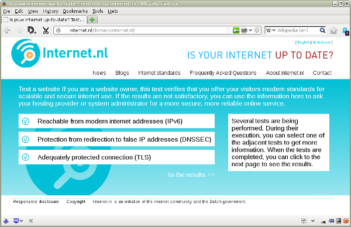
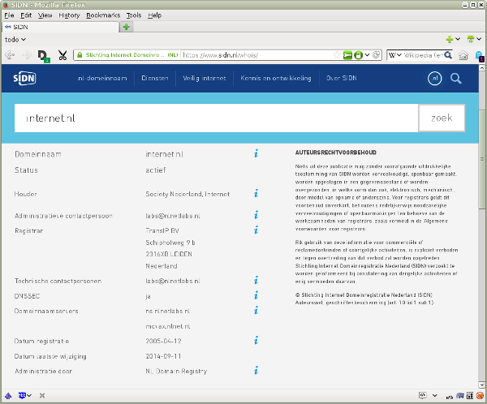
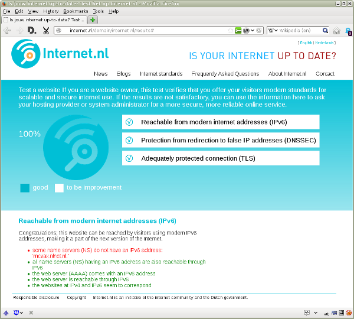
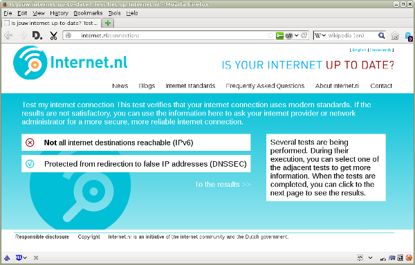
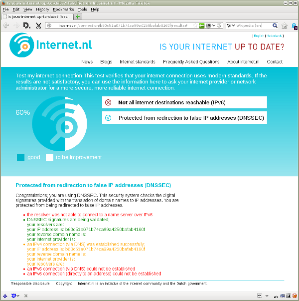
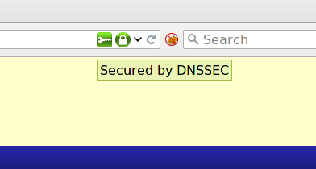

## General

### What is DNS?

DNS is the registration system for names and their corresponding numbers on
the Internet. It&#39;s similar to a phone book.

The names of destinations on the Internet are called domain names. An example
is www.example.com. A domain name is what you see in the address bar at the
top of your web browser when you visit a website. You also use a domain name
when you address an [e-mail](/faqs/mail/) message, for example to
john@example.com.

Every computer on the Internet can be reached through its own unique
[IP address](/faqs/ipv6/#IPadres). Examples are 192.0.2.26
([IPv4](/faqs/ipv6/#IPv4)) and 2001:db8::1:26 ([IPv6](/faqs/ipv6/)). DNS, an
abbreviation of Domain Name System, is a background activity that translates
domain names into IP addresses. That is how your web browser or mail message
reaches its correct destination.

### What is DNSSEC?

DNSSEC is a security system for [DNS](/faqs/dnssec/#DNS). DNS itself works
fine, but the translation of a domain name to an IP address is not protected.
That is a security risk, because attackers can get hold of passwords or other
sensitive information by redirecting network traffic to false IP addresses.

DNSSEC, an abbreviation of Domain Name System Security Extensions, extends DNS
by adding a security feature: a digital signature that guarantees the
translation of a domain name to the correct IP address. Any internet user can
check the signature automatically, and so avoid being redirected to a false IP
address.

### Who is using DNSSEC?

Currently, over 40 percent of all .nl domains have been signed with
[DNSSEC](/faqs/dnssec/#DNSSEC). Examples are digid.nl, bof.nl, postnl.nl, and
nrcnext.nl. Almost all the other top-level domains &mdash; such as .com, .net
and .org &mdash; allow subordinate domain names to be signed with DNSSEC.

More and more organisations are also checking the validity of DNSSEC
signatures. Examples are the Dutch Central Government (RijksDNS), the
Municipality of Heerlen, internet service provider BIT, internet provider
Edutel, and Google&#39;s Public DNS. These organisation protect their users
from being redirected to false [IP addresses](/faqs/ipv6/#IPaddress).

### What does DNSSEC protect you from?

[DNSSEC](/faqs/dnssec/#DNSSEC) protects against attacks on the
[DNS system](/faqs/dnssec/#DNS). Without DNSSEC, attackers can get hold of
passwords or other sensitive information by redirecting network traffic to
false [IP addresses](/faqs/ipv6/#IPaddress).

Several cases of successful attacks have been published. For example, people
using the website of a large Brazilian bank were redirected to a false IP
address. The attacker was able to accomplish this by cracking the DNS system
of an internet provider. If the bank and the provider had used DNSSEC, users
would have been protected against this attack. Most incidents, however, are
never noticed or never published in the news.

### What is the difference between DNSSEC and TLS?

TODO

## For domain name holders

### Why is DNSSEC important to me as a holder of a domain name?

To anyone providing online services &mdash; for example, a website, a
[mail domain](/faqs/mail/) or a shop &mdash; it is crucial that visitors reach
the correct [IP address](/faqs/ipv6/#IPaddress) and that incoming mail
messages are delivered to the correct &quot;mailbox&quot;.

In just a few minutes an attacker can set up a fake website that is an exact
copy of your site. Most visitors will never notice the difference, because
everything but the IP address is exactly the same. The same is true for fake
mailboxes. This way, attackers can get hold of passwords or other sensitive
information that should stay private. [DNSSEC](/faqs/dnssec/#DNSSEC) stops
users from being redirected to a false IP address, or having their messages
delivered to a fake mailbox.

If you run a business, much your interaction with customers, partners and
suppliers has probably already shifted to the Internet. This has strongly
increased the importance of a well-protected digital presence. Visitors should
be able to count on the reputation of brands in the online world as well as in
traditional shops. An insecure internet service, let alone an incident,
damages the reputation of your brand as well as your business.

### How does DNSSEC affect me as the holder of a domain name?

[DNSSEC](/faqs/dnssec/#DNSSEC) is a &quot;transparent&quot; extension to the
existing [DNS system](/faqs/dnssec/#DNS). This means that neither the domain
name holder nor the internet user will notice any difference when DNSSEC is
installed on a domain. When the user has enabled DNSSEC too, both parties will
immediately benefit from a strong layer of security added to the DNS system. A
fake website or mailbox is simply blocked. Internet users who are not yet
using DNSSEC can still visit a signed domain name without any problems.

### How do I check whether DNSSEC on my domain name is working well?

This site offers a comprehensive test of [DNSSEC](/faqs/dnssec/#DNSSEC) for
domain names:

- [DNSSEC test](/domain/)

Filling out a domain name &mdash; for example www.example.com &mdash;
immediately shows whether DNSSEC is enabled and working well. You can use the
detailed test report to ask your DNS administrator to enable DNSSEC or to
solve any issues.

### How do I protect my domain name with DNSSEC?

Whoever manages the [DNS system](/faqs/dnssec/#DNS) for a domain name should
be able to install [DNSSEC](/faqs/dnssec/#DNSSEC). In larger organisations,
the system is most often administered by the internal IT department or an
external service provider. In smaller organisations, the DNS service is often
part of a package from a hosting provider or another service provider who has
registered the domain name on behalf of the holder.

### Who is the DNS administrator of my domain name?

You can use the public WHOIS domain name registration to obtain information
about your domain. Usually this information includes the domain names of the
associated [DNS systems](/faqs/dnssec/#DNS). These names often allow you to
find out who is the administrator of your domain name. For the .nl domain,
WHOIS information is provided by [SIDN](/partners/#SIDN):

- [WHOIS domain name registration](https://www.sidn.nl/whois/)

The domain names of the DNS systems for the domain name internet.nl, for
example, are ns.nlnetlabs.nl and mcvax.nlnet.nl. This information shows that
this domain name is administered by [NLnet](/partners/#NLnet), one of the
organisations participating in this project.

This information is also part of the detailed report from the
[domain name test](/domain/) provided on this site.

### What if my DNS administrator cannot or doesn&#39;t want to help me with DNSSEC?

If your current [DNS administrator](/faqs/dnssec/#DNS) cannot or doesn&#39;t
want to offer [DNSSEC](/faqs/dnssec/#DNSSEC), you can transfer your domain to
a DNS administrator who does. Many DNS administrators now offer DNSSEC
signing. [SIDN](/partners/#SIDN), the registry for the .nl domain, provides a
[list of parties who are able to secure .nl domain names with DNSSEC](https://www.sidn.nl/registrars/?country=&dnssec=true).

In order to switch, the new DNS administrator needs the so-called
&quot;zone file&quot;. This file contains a list of your domain names and
associated [IP addresses](/faqs/ipv6/#IPaddress). To transfer a domain to a
new hosting provider, you will also need the &quot;transfer token&quot;. This
is a code that the current administrator gives to the legitimate holder of the
domain, that way preventing attackers from hijacking the domain. SIDN provides
[extensive information on the transfer of domain names](https://www.sidn.nl/a/nl-domeinnaam/domeinnaam-verhuizen).

## For internet users

### Why is DNSSEC important to me as an internet user?

Whether you are visiting an online bank, a web shop or your company&#39;s own
network, it is crucial that the domain name you type connects you to the
correct [IP address](/faqs/ipv6/#IPaddress), and thus to the right computer
system.

Every day, attackers tempt internet users on a massive scale to visit fake
sites. They aim to get hold of passwords and personal or business information.
This information is then used to steal money, to order goods under false
names, or to commit identity fraud or espionage. The same applies to delivery
addresses for [e-mail](/faqs/mail/). Messages often contain personal or
business information that should not end up in the wrong place.
[DNSSEC](/faqs/dnssec/#DNSSEC) &mdash; along with [TLS](/faqs/tls/) &mdash;
stops visitors from being redirected to fake websites or sending messages to
fake &quot;mailboxes&quot;.

### How does DNSSEC affect me as an internet user?

Normally, you will not notice anything different when you are using
[DNSSEC](/faqs/dnssec/#DNSSEC). But if the genuine holder of the domain name
is also using DNSSEC, a reference to a fake website or &quot;mailbox&quot;
will be detected by the system. Access to the fake site will be blocked, and
messages to the fake mailbox will be returned to you. DNSSEC protects you and
domain name holders through a strong cryptographic security layer on top of
the [DNS system](/faqs/dnssec/#DNSSEC).

### As an internet user, how do I check that DNSSEC is working well?

This site offers a comprehensive test of [DNSSEC](/faqs/dnssec/#DNSSEC) for
internet users:

- [connection test](/connection/)

The test immediately shows whether DNSSEC is enabled and working.

You can use the detailed test report to ask your internet provider or the
network administrator to enable DNSSEC or to solve any issues.

### Can my internet provider enable DNSSEC for me?

Certainly. Most internet users rely on the [DNS services](/faqs/dnssec/#DNS)
of their internet providers to look up the [IP address](/faqs/ipv6/#IPaddress)
to a domain name. The provider can check the digital signature before
forwarding the IP address to the end user. For the end user, this is the
easiest and most obvious way to use DNSSEC.

### What if my internet provider cannot or doesn&#39;t want to help me with DNSSEC?

If your current internet provider cannot or doesn&#39;t want to offer
[DNSSEC](/faqs/dnssec/#DNSSEC), you can switch to a provider who does. These
providers are known to use DNSSEC for their [DNS services](/faqs/dnssec/#DNS):

- [Edutel](http://www.edutel.nl/)
- [BIT](https://www.bit.nl/)
- [RijksDNS](http://www.dnssec.nl/cases/rijksdns-valideert-dnssec-ondertekening-volgt-later-dit-jaar.html)
  (for anyone using Rijksnetwerk, the Dutch central government network).
- [XS4All](https://www.xs4all.nl/)  
  only [DNS server](https://www.xs4all.nl/klant/servers/) 194.109.9.99
  ([IPv6](/faqs/ipv6/): 2001:888:0:9::99) supports DNSSEC validation; in order
  to use this server, you should configure it as the only DNS server in your
  internet router, or in combination with other
  [validating DNS servers](/faqs/dnssec/#)

### Are there any other ways to deploy DNSSEC?

If switching to another internet provider is not an option, you can use a
public [DNS service](/faqs/dnssec/#DNS) that supports
[DNSSEC](/faqs/dnssec/#DNSSEC). To do so, you will have to adjust the
[IP addresses](/faqs/ipv6/#IPadres) of the DNS service on your broadband
router or your computer. These DNS service providers are known to support
DNSSEC:

- [NIC.CZ&#39;s Open DNSSEC Validating Resolvers](https://labs.nic.cz/en/odvr.html)
- [OARC&#39;;s Open DNSSEC Validating Resolver](https://www.dns-oarc.net/oarc/services/odvr)
- [Google Public DNS](https://developers.google.com/speed/public-dns/).

Note that the providers of these free services will be able to see all your
DNS requests.

### Can I enable DNSSEC on my own computer?

Certainly. This option is even more secure than the ones discussed above,
because it also protects the link between your computer and the
[DNS service](/faqs/dnssec/#DNS).

To make this possible, [NLnet Labs](/partners/#NLnetLabs) has developed free
validation software for Windows, Linux, and Mac OS X:

- [dnssec-trigger](https://www.nlnetlabs.nl/projects/dnssec-trigger/)

In the future we expect [DNSSEC validation](/faqs/dnssec/#DNSSEC) to be a
standard part of every computer and mobile device.

### How can I get my webbrowser to validate DNSSEC?

Some people may find it too difficult to install
[DNSSEC software](/faqs/dnssec/#DNSSEC) or adjust the
[IP addresses](/faqs/ipv6/IPaddress) of their
[DNS service](/faqs/dnssec/#DNS). A simpler option is to have the digital
signatures checked by their web browsers.

CZ.NIC, the &quot;Czech SIDN&quot;, has developed a plugin that is available
for all popular browsers: Internet Explorer, Mozilla Firefox, Google
Chrome/Chromium, Opera, and Apple Safari. You can download it here:

- [DNSSEC/TLSA Validator](https://www.dnssec-validator.cz/)

Note: the plugin checks digital signatures only for connections that are set
up from the web browser when you visit a website. Other types of internet
connections, for example for sending [e-mail](/faqs/mail/), are not checked by
this browser-specific plugin.

### What else can DNSSEC do?

[DNSSEC](/faqs/dnssec/#DNSSEC) adds digital signatures to all information
published through the [DNS system](/faqs/dnssec/#DNS). Currently, this
security feature is mostly used to protect the translation from domain names
to [IP addresses](/faqs/ipv6/IPaddress). We expect that in the coming years
this technology will be used to publish other information in a secure way too.

A security option known as DANE seems likely to become the first new
application of DNSSEC. DANE allows a user to check automatically, via DNS,
that a digital certificate really belongs to a specific website or
&quot;mailbox&quot;. This technology could, for example, have prevented the
[DigiNotar fiasco](https://en.wikipedia.org/wiki/DigiNotar#Issuance_of_fraudulent_certificates).

The [DKIM, SPF and DMARC standards](/faqs/mail/) that protect e-mail benefit
from DNSSEC too, since they depend on reliable DNS information to operate.

## More information

- [DNSSEC.nl](http://dnssec.nl/)
- [SIDN over DNSSEC](https://www.sidn.nl/a/veilig-internet/dnssec)
- [DNSSEC at the ISOC Deploy360 Programme](http://www.internetsociety.org/deploy360/dnssec/)
- [DNSSEC on 'apply or explain' list of Standardisation Forum](https://lijsten.forumstandaardisatie.nl/open-standaard/dnssec)
- [DNSSEC on Wikipedia](https://en.wikipedia.org/wiki/Domain_Name_System_Security_Extensions).
