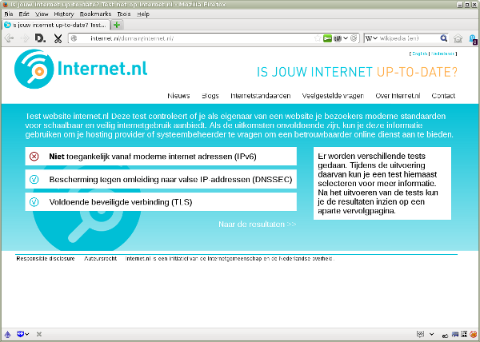
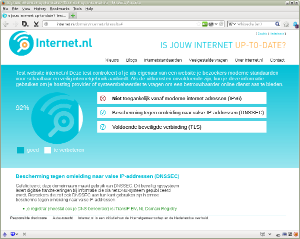
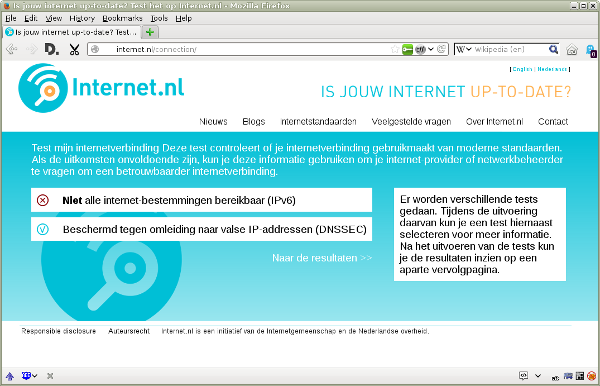
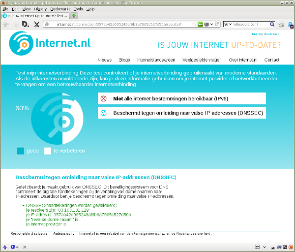

## Algemeen

### Wat is DNS?

DNS is het registratiesysteem van namen en bijbehorende nummers op het
Internet. Het is vergelijkbaar met een telefoonboek.

De namen van bestemmingen op Internet heten domeinnamen. Een voorbeeld is
www.example.nl. Een domeinnaam zie je onder andere in de balk bovenin je
webbrowser als je een website bezoekt. Maar je gebruikt ook een domeinnaam als
je [e-mail](/faqs/mail/) adresseert, bijvoorbeeld aan jan@example.nl.

Iedere computer op Internet is bereikbaar via een eigen uniek
[IP-adres](/faqs/ipv6/#IPadres). Voorbeelden daarvan zijn 192.0.2.26
([IPv4](/faqs/ipv6/#IPv4)) en 2001:db8::1:26 ([IPv6](/faqs/ipv6/)). DNS, een
afkorting van Domain Name System, zorgt op de achtergrond voor de vertaling
van domeinnamen naar IP-adressen. Op die manier komt je webbrowser of je
mail-bericht op de juiste bestemming terecht.

### Wat is DNSSEC?

DNSSEC is een beveiligingssysteem voor [DNS](/faqs/dnssec/#DNS). Op zich werkt
DNS prima, maar de vertaling van domeinnaam naar
[IP-adres](/faqs/ipv6/#IPadres) is niet beveiligd. Dat is een risico: een
kwaadwillende kan verkeer van een gebruiker omleiden naar een vals IP-adres.
Op die manier zou hij paswoorden of andere gevoelige informatie kunnen
buitmaken.

DNSSEC, een afkorting van Domain Name System Security Extensions, breidt DNS
uit met een extra beveiliging. De vertaling van domeinnaam naar IP-adres wordt
daartoe voorzien van een digitale handtekening. Een internetgebruiker kan die
handtekening automatisch laten controleren. Dat voorkomt dat hij misleid wordt
naar een vals IP-adres.

### Wie gebruikt DNSSEC?

Meer dan 40 procent van alle .nl-domeinen is al ondertekend met
[DNSSEC](/faqs/dnssec/#DNSSEC). Voorbeelden daarvan zijn digid.nl, bof.nl,
postnl.nl en nrcnext.nl. Daarnaast bieden vrijwel alle andere top-level
domeinen &mdash; bijvoorbeeld .com, .net en .org &mdash; ook de mogelijkheid
om onderliggende domeinnamen met DNSSEC te beveiligen.

Steeds meer organisaties controleren ook de geldigheid van
DNSSEC-handtekeningen. Voorbeelden daarvan zijn de Rijksoverheid (RijksDNS),
de gemeente Heerlen, internet-dienstverlener BIT, internet-provider Edutel en
Google&#39;s Public DNS. Zo beschermen zij hun gebruikers tegen misleiding
naar valse [IP-adressen](/faqs/ipv6/#IPadres).

### Waar beschermt DNSSEC tegen?

[DNSSEC](/faqs/dnssec/#DNSSEC) beschermt tegen aanvallen op het
[DNS-systeem](/faqs/dnssec/#DNS). Hiermee wordt voorkomen dat een
kwaadwillende het verkeer van gebruikers omleidt naar een vals
[IP-adres](/faqs/ipv6/#IPadres). Op die manier zou hij wachtwoorden of andere
gevoelige informatie kunnen buitmaken.

Er zijn diverse gevallen van geslaagde aanvallen bekend. Daarbij werden
bijvoorbeeld de bezoekers van een grote Braziliaanse bank omgeleid naar een
vals IP-adres. Daarvoor werd het DNS-systeem van een internet-provider
gekraakt. Als de bank en de provider DNSSEC hadden gebruikt, dan waren de
gebruikers beschermd geweest tegen deze misleiding. De meeste kraken worden
echter nooit opgemerkt of komen nooit in het nieuws.

### Wat is het verschil tussen DNSSEC en TLS?

TODO

## Voor domeinnaamhouders

### Waarom is DNSSEC voor mij als houder van een domeinnaam belangrijk?

Als aanbieder van internet-diensten &mdash; bijvoorbeeld een website, een
[mail-domein](/faqs/mail/) of een webwinkel &mdash; is het van cruciaal belang
dat bezoekers inderdaad op het juiste [IP-adres](/faqs/ipv6/#IPadres) uitkomen
en dat binnenkomende mail inderdaad bij de juiste &quot;elektronische
brievenbus&quot; wordt afgeleverd.

Een valse website die een exacte kopie is van het origineel is in een paar
minuten opgezet. Omdat alleen het IP-adres anders is, zien de meeste
gebruikers daar niets van. Hetzelfde geldt voor een valse brievenbus. Daarmee
kunnen kwaadwillenden ongemerkt informatie achterhalen die niet voor hen
bestemd is, bijvoorbeeld wachtwoorden of andere gevoelige informatie.
[DNSSEC](/faqs/dnssec/#DNSSEC) voorkomt dat bezoekers daadwerkelijk naar
zo&#39;n valse site worden omgeleid of dat hun mail-berichten bij een valse
brievenbus worden afgeleverd.

Als je een bedrijf hebt is veel van de interactie met klanten, partners en
leveranciers waarschijnlijk al naar Internet verschoven. Ook overheden en
andere organisaties communiceren onderling en met burgers en bedrijven steeds
meer via Internet. Daarmee is ook het belang van een goed beveiligde digitale
ingang sterk toegenomen. Bezoekers moeten ook online op de betrouwbaarheid van
een merk of organisatie kunnen rekenen. Een onveilige internet-dienst, laat
staan een kraak, levert zowel reputatie- als zakelijke/financiële schade op.

### Wat merk ik als domeinnaamhouder van DNSSEC?

[DNSSEC](/faqs/dnssec/#DNSSEC) is een volledig &quot;transparante&quot;
toevoeging op het bestaande [DNS-systeem](/faqs/dnssec/#DNS). Dat betekent dat
DNSSEC op een domein aan gezet kan worden zonder dat de houder of de
internetgebruikers daar iets van merken.

Voor gebruikers die ook DNSSEC ondersteunen wordt er voor beide partijen
direct een sterke beveiliging aan het DNS-systeem toegevoegd. Een valse
website of een valse brievenbus wordt dan simpelweg geblokkeerd.
Internetgebruikers die nog geen DNSSEC ondersteunen kunnen beveiligde
domeinnamen zonder problemen blijven gebruiken.

### Hoe controleer ik of DNSSEC voor mijn domeinnaam goed werkt?

Deze site biedt een uitgebreide test op [DNSSEC](/faqs/dnssec/#DNSSEC) voor
domeinnamen:

- [DNSSEC test](/domain/)

Het invullen van een domeinnaam &mdash; bijvoorbeeld www.example.nl &mdash;
levert direct inzicht of DNSSEC aan staat en goed werkt. Je kunt de
gedetailleerde testrapportage gebruiken om je DNS-beheerder te vragen DNSSEC
aan te zetten of eventuele problemen op te lossen.

### Hoe beveilig ik mijn domeinnaam met DNSSEC?

Degene die het [DNS-systeem](/faqs/dnssec/#DNS) voor een domeinnaam beheert
moet ook [DNSSEC](/faqs/dnssec/#DNSSEC) aan kunnen zetten. In een grotere
organisatie is de beheerder meestal de interne ICT-afdeling of een externe
dienstverlener. Bij kleinere organisaties is de DNS-dienst vaak onderdeel van
een pakket bij de hosting provider of een andere dienstverlener die een
domeinnaam in opdracht van de houder heeft geregistreerd.

### Wie is de DNS-beheerder van mijn domeinnaam?

Via de openbare domeinnaamregistratie-informatie WHOIS kun je informatie over
je domeinnaam vinden. Daarin staan meestal ook de domeinnamen van de
bijbehorende [DNS-systemen](/faqs/dnssec/#DNSSEC). Op basis van deze
domeinnamen kun je meestal nagaan wie de beheerder van je domeinnaam is. Voor
het .nl-domein wordt de WHOIS-informatie aangeboden door
[SIDN](/partners/#SIDN):

- [WHOIS domeinnaamregistratie](https://www.sidn.nl/whois/)

Bijvoorbeeld voor het domeinnaam internet.nl zijn de domeinnamen van de
DNS-systemen ns.nlnetlabs.nl en mcvax.nlnet.nl. Daaraan kan men zien dat deze
domeinnaam door [NLnet](/partners/#NLnet), een van de partners in dit project,
wordt beheerd.

Deze informatie komt ook terug in de gedetailleerde rapportage van de
[domeinnaam-test](/domain/) op deze site.

### Wat als mijn DNS-beheerder mij niet kan of wil helpen met DNSSEC?

Als je huidige [DNS-beheerder](/faqs/dnssec/#DNS) geen
[DNSSEC](/faqs/dnssec/#DNSSEC) kan of wil aanbieden, dan is het goed mogelijk
om over te stappen naar een beheerder die dat wel doet. Veel DNS-beheerders
bieden inmiddels DNSSEC-ondertekening aan. [SIDN](/partners/#SIDN), de
beheerder van het .nl-domein, biedt een
[lijst van partijen die .nl-domeinnamen met DNSSEC kunnen beveiligen](https://www.sidn.nl/registrars/?country=&dnssec=true).

Bij een overstap heeft de nieuwe DNS-beheerder de zogenaamde
&quot;zone file&quot; nodig. Dat is de lijst van jouw domeinnamen met
bijbehorende [IP-adressen](/faqs/ipv6/#IPadres). Bij het overzetten van een
domeinnaam naar een nieuwe hosting provider is bovendien het
&quot;verhuistoken&quot; nodig. Dat is een code die de huidige provider alleen
afgeeft aan de rechtmatige houder van de domeinnaam. Zo wordt voorkomen dat
een kwaadwillende de domeinnaam kan kapen. SIDN biedt
[uitgebreide informatie aan over het verhuizen van domeinnamen](https://www.sidn.nl/a/nl-domeinnaam/domeinnaam-verhuizen).

## Voor internetgebruikers

### Waarom is DNSSEC voor mij als Internet-gebruiker belangrijk?

Of je nu een online bank, een webwinkel of het bedrijfsnetwerk bezoekt, het is
van cruciaal belang dat je vanaf de domeinnaam op het juiste
[IP-adres](/faqs/ipv6/#IPadres) en dus op het juiste computersysteem terecht
komt.

Dagelijks proberen kwaadwillenden op grote schaal internetgebruikers te
verleiden om vervalste sites te bezoeken. Doel is om hen login-gegevens en
persoonlijke of zakelijke informatie te ontfutselen. Die wordt vervolgens
misbruikt om geld te stelen, goederen te bestellen op een valse naam,
identiteitsfraude te plegen of spionage te bedrijven. Hetzelfde geldt voor de
afleveradressen van [e-mail](/faqs/mail/). Vaak bevatten berichten
persoonlijke of zakelijke informatie die niet op de verkeerde plek terecht mag
komen. [DNSSEC](/faqs/dnssec/#DNSSEC) voorkomt &mdash; samen met
[TLS](/faqs/tls/) &mdash; dat bezoekers daadwerkelijk naar een valse website
worden omgeleid of dat hun mail-berichten bij een valse &quot;brievenbus&quot;
worden afgeleverd.

### Wat merk ik als internetgebruiker van DNSSEC?

Normaal gesproken merk je niets van het gebruik van
[DNSSEC](/faqs/dnssec/#DNSSEC). Maar als de echte eigenaar van een domeinnaam
ook DNSSEC gebruikt, dan zal een verwijzing naar een valse website of
&quot;brievenbus&quot; worden gedetecteerd. Toegang tot die valse website
wordt dan geblokkeerd en mailberichten naar de valse brievenbus worden naar
jou teruggestuurd. DNSSEC beschermt jou en domeinnaamhouders door een sterke
cryptografische beveiliging aan het [DNS-systeem](/faqs/dnssec/#DNS) toe te
voegen.

### Hoe controleer ik als internetgebruiker de goede werking van DNSSEC?

Deze site biedt een uitgebreide test op [DNSSEC](/faqs/dnssec/#DNSSEC) voor
internetgebruikers:

- [verbindingstest](/connection/)

De test laat direct zien of DNSSEC aan staat en goed werkt.

Je kunt de gedetailleerde testrapportage gebruiken om bij je internet-provider
of de ICT-afdeling te vragen om DNSSEC aan te zetten of eventuele problemen op
te lossen.

### Kan mijn internet-provider DNSSEC voor mij aan zetten?

Zeker. De meeste internetgebruikers vertrouwen op de
[DNS-dienst](/faqs/dnssec/#DNS) van hun internet-provider voor het opzoeken
van het [IP-adres](/faqs/ipv6/#IPadres) bij een domeinnaam. De provider kan de
digitale handtekening controleren voordat hij het IP-adres naar de
eindgebruiker doorstuurt. Dit is voor de eindgebruiker de makkelijkste en
meest voordehandliggende manier om DNSSEC te gebruiken.

### Wat als mijn internet-provider mij niet kan of wil helpen met DNSSEC?

Als je huidige internet-provider de
[DNSSEC-handtekeningen](/faqs/dnssec/#DNSSEC) niet wil controleren voor zijn
klanten, dan kan je overstappen naar een provider die wel DNSSEC ondersteunt.
Van deze providers is bekend dat ze DNSSEC op hun
[DNS-dienst](/faqs/dnssec/#DNS) toepassen:

- [Edutel](http://www.edutel.nl/)
- [BIT](https://www.bit.nl/)
- [RijksDNS](http://www.dnssec.nl/cases/rijksdns-valideert-dnssec-ondertekening-volgt-later-dit-jaar.html)
  (voor iedereen die het Rijksnetwerk gebruikt)
- [XS4All](https://www.xs4all.nl/)  
  alleen [DNS-server](https://www.xs4all.nl/klant/servers/) 194.109.9.99
  ([IPv6](/faqs/ipv6/): 2001:888:0:9::99) ondersteunt DNSSEC-validatie; om
  deze server te gebruiken moet je deze als enige DNS-server op je
  internet-router instellen, of in combinatie met andere
  [validerende DNS-servers](/faqs/dnssec/#)

### Zijn er nog andere mogelijkheden om DNSSEC te gebruiken?

Als overstappen naar een andere internet-provider geen optie is, dan kan je
ook een publieke [DNS-dienst](/faqs/dnssec/#DNS) gebruiken die
[DNSSEC](/faqs/dnssec/#DNSSEC) ondersteunt. Daarvoor is het nodig om de
[IP-adressen](/faqs/ipv6/#IPadres) van de DNS-dienst in je internet-router of
op je computer aan te passen. Van deze DNS-dienstverleners is bekend dat ze
DNSSEC ondersteunen:

- [NIC.CZ&#39;s Open DNSSEC Validating Resolvers](https://labs.nic.cz/en/odvr.html)
- [OARC&#39;s Open DNSSEC Validating Resolver](https://www.dns-oarc.net/oarc/services/odvr)
- [Google Public DNS](https://developers.google.com/speed/public-dns/)

Bedenk dat de aanbieders van deze gratis diensten dan wel al je
DNS-opvragingen kunnen zien.

### Kan ik DNSSEC ook zelf op mijn computer aan zetten?

Zeker. Deze mogelijkheid is zelfs nog veiliger dan de eerder genoemde opties,
want zo wordt ook het laatste gedeelte tussen jouw computer en de
[DNS-dienst](/faqs/dnssec/#DNS) beschermd.

[NLnet Labs](/partners/#NLnetLabs) heeft hiervoor vrij te gebruiken
validatie-software ontwikkeld. Deze is beschikbaar voor zowel Windows, Linux
als Mac OS X:

- [dnssec-trigger](https://www.nlnetlabs.nl/projects/dnssec-trigger/)

De verwachting is dat de validatie van [DNSSEC](/faqs/dnssec/#DNSSEC) in de
toekomst standaard onderdeel zal zijn van alle computer- en mobiele
apparatuur.

### Hoe laat ik mijn web-browser DNSSEC controleren?

Voor sommige mensen is het wellicht te moeilijk om zelf
[DNSSEC-software](/faqs/dnssec/#DNSSEC) te installeren of de
[IP-adressen](/faqs/ipv6/#IPadres) van de [DNS-dienst](/faqs/dnssec/#DNS) aan
te passen. Een eenvoudiger mogelijkheid is om de controle van de digitale
handtekeningen door de webbrowser te laten uitvoeren.

CZ.NIC, de &quot;Tsjechische SIDN&quot;, heeft een plugin ontwikkeld die voor
alle populaire browsers beschikbaar is: Internet Explorer, Mozilla Firefox,
Google Chrome/Chromium, Opera en Apple Safari. Je kunt deze hier downloaden:

- [DNSSEC/TLSA Validator](https://www.dnssec-validator.cz/)

Let op: deze plugin controleert de digitale handtekeningen alleen voor
verbindingen die vanuit de webbrowser worden opgezet bij het bezoeken van een
website. Andersoortige internet-verbindingen, zoals voor het versturen van
[e-mail](/faqs/mail/), worden door deze browser-specifieke plugin niet
gecontroleerd.

### Wat kan er nog meer met DNSSEC?

[DNSSEC](/faqs/dnssec/#DNSSEC) zet digitale handtekeningen onder alle
informatie die via het [DNS-systeem](/faqs/dnssec/#DNS) wordt gepubliceerd.
Deze beveiliging wordt nu nog vooral gebruikt om de vertaling van domeinnamen
naar [IP-adressen](/faqs/ipv6/IPadres) te beschermen. De verwachting is dat
deze technologie in de komende jaren ook gebruikt gaat worden om andere
informatie op een veilige manier te publiceren.

DANE lijkt de eerste nieuwe toepassing van DNSSEC te gaan worden. Daarmee kan
een gebruiker automatisch via DNS controleren of een digitaal certificaat
echt bij een specifieke website of &quot;elektronische brievenbus&quot; hoort.
Daarmee had bijvoorbeeld het
[DigiNotar-debacle](http://nl.wikipedia.org/wiki/Hack_bij_DigiNotar) kunnen
worden voorkomen.

Ook de [DKIM-, SPF- en DMARC-standaarden](/faqs/mail/) voor de beveiliging van
e-mail hebben baat bij DNSSEC, omdat zij voor een goede werking afhankelijk
zijn van betrouwbare DNS-informatie.

## Meer informatie

- [DNSSEC.nl](http://dnssec.nl/)
- [SIDN over DNSSEC](https://www.sidn.nl/a/veilig-internet/dnssec)
- [DNSSEC bij het ISOC Deploy360 Programma](http://www.internetsociety.org/deploy360/dnssec/)
- [DNSSEC op 'pas toe of leg uit'-lijst van Forum Standaardisatie](https://lijsten.forumstandaardisatie.nl/open-standaard/dnssec)
- [DNSSEC op Wikipedia](http://nl.wikipedia.org/wiki/Domain_Name_System#DNSSEC)
