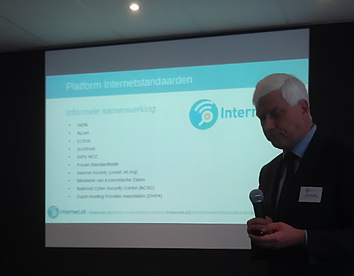
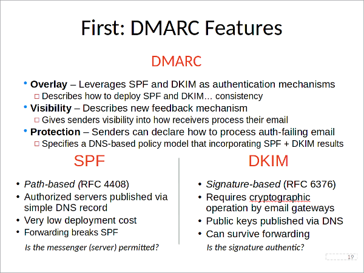
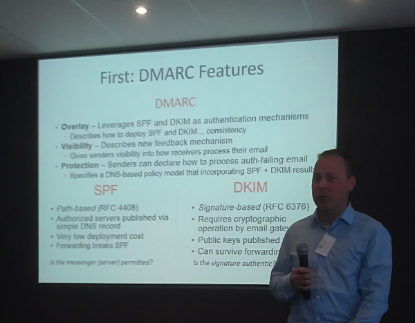

Op de masterclass waren meer dan 60 geïnteresseerden afgekomen. De sessie werd
geopend door
[Gerben Klein Baltink](/news/het-internet-is-van-ons-allemaal/),
kwartiermaker voor het Platform Internetstandaarden, die de
[Internet.nl portal](https://internet.nl/) aan het publiek demonstreerde. De
site werd anderhalve week geleden
[tijdens de GCCS Cybertop gelanceerd](/news/website-internet-nl-drukbezocht-na-cybertop/)
Er zijn sindsdien ruim 20 duizend tests uitgevoerd. DMARC is een van de zes
[standaarden](/standards/) die door het Platform gepromoot
worden.

## Authenticatie van de afzender

Draegen schetste in zijn sessie het belang van e-mail: mail is meerdere orden
groter dan het web en social media. Hoewel het mail-protocol inmiddels meer
dan 35 jaar oud is, is de authenticatie van de afzender nog steeds niet
geïmplementeerd. Draegen wijt dit aan het moeizame proces waarmee standaarden
tot stand komen en uitgerold worden.

Specifiek voor authenticatie van de afzender bestaat de oplossing nu uit drie
verschillende protocollen: DKIM
ondertekent zowel de "envelope" als de inhoud van een bericht. Zo wordt
voorkomen dat kwaadwillenden een bericht namens een ander kunnen verzenden
(spoofing) of de inhoud van een bericht onderweg kunnen veranderen.
SPF publiceert een lijst van geldige
verzenders, zodat ontvangende systemen deze kunnen controleren voor zij een
bericht aannemen. DMARC geeft
tenslotte een aanwijzing (policy) aan ontvangers hoe om te gaan met inkomende
berichten waarvan de DKIM- of SPF-controle niet in orde blijkt te zijn.
Bovendien kunnen ontvangers terugrapporteren naar de beheerder van een
mail-domein. Op die manier krijgt een beheerder inzicht in de berichten die
door of namens zijn domein worden verstuurd.

De dmarcian.com portal is een commerciële dienst die de rapportages van
ontvangers tot nette overzichten verwerkt. De werking van
afzender-authenticatie werd ook gedemonstreerd door de Gemeente Heerlen en
dienstverlener Measuremail. Zij lieten zien hoe geauthenticeerde mail wel
aankomt en vervalste mail wordt geblokkeerd voor beveiligde domeinen.

## "Zeer waarschijnlijk echt"

De standaarden voor mail-authenticatie zijn op dit moment volwassen en zowel
voor commerciële als open source mail-systemen beschikbaar. Draegen hamert dan
ook op de invoering van DKIM, SPF en DMARC. De verwerking van binnenkomende
mail is namelijk peperduur. Grote mail-verwerkers hebben een hele batterij van
systemen staan die elk binnenkomend bericht moeten scannen op phishing,
spamming, virussen en andere malware. Tegelijkertijd kan het ten onrechte
afwijzen van een echt bericht voor een organisatie grote schade opleveren.
Authenticatie van de afzender helpt de ontvangende systemen om binnenkomende
mail gelijk als "zeer waarschijnlijk echt" te kwalificeren. Er staat immers
een elektronische handtekening onder (DKIM) en/of het verzendende systeem is
geauthenticeerd (SPF).

Het huidige systeem, waarbij verzendende systemen op basis van hun
internet-adres als betrouwbaar of onbetrouwbaar worden bestempeld, is
bovendien niet houdbaar in een wereld die nu naar
IPv6 beweegt, een van de andere
internetstandaarden die door het Platform gepromoot wordt. Waar IPv4 "slechts"
vier miljard internet-adressen ondersteunt, zijn dat er voor IPv6 "oneindig
veel". Lijsten bijhouden is daarmee praktisch onmogelijk geworden. Dat
betekent dat we sowieso naar een systeem moeten waarbij niet de reputatie van
het versturende IP-adres van belang is maar die van het mail-domein van de
afzender. En dat maakt authenticatie van de afzender onderdeel van de
merkstrategie en -betrouwbaarheid van een organisatie.

Draegen vat het belang van DKIM, SPF en DMARC als volgt samen: "Als je geen
DMARC doet, dan concurreer je met de slechterikken om er zelf niet als een
slechterik uit te zien. Waarom zou je?"

## Presentaties

- [State of DMARC](3_DMARC_NL.pdf), door Tim Draegen
- [Measuremail en dmarcian](4_DMARC_masterclass_april_2015.pdf)
- [End user awareness of security](internet.nl-NL_2.pdf), door Gerben Klein
  Baltink
